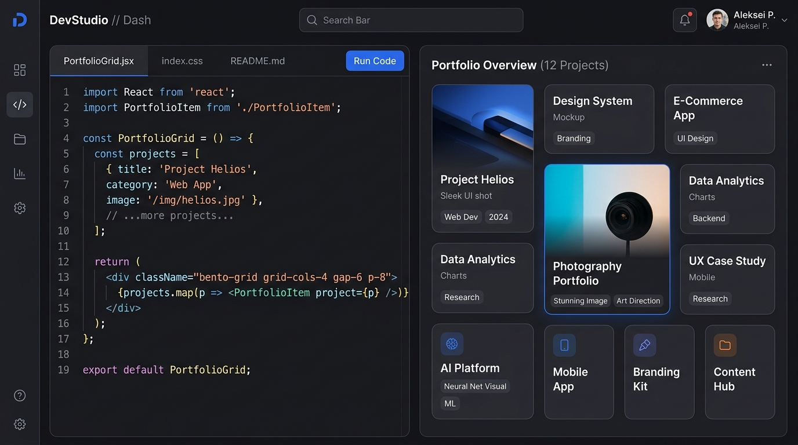

# Hasini Raparthi — Personal Portfolio Web Application

A responsive, high-performance **Bento Grid Personal Portfolio & Digital Résumé** built for **Hasini Raparthi** (B.Com IT student at St. Joseph's Degree & PG College, Hyderabad).



---

## 🌟 Key Features

- **Modular Bento Grid Layout**: Organized profile sections inspired by modern developer portfolios.
- **Interactive Python IDE Simulator**: In-browser Python script evaluation runner.
- **Live Data Analytics Visualizer**: Interactive Chart.js visualizer with dataset switching.
- **Web Audio API Click FX**: Native audio feedback for button interactions and code triggers.
- **1-Click Email Copy Utility**: Easy email copying for recruiters.
- **100% Responsive & Touch-Optimized**: Smooth performance across desktop, tablet, and mobile.

---

## 💻 Tech Stack

- **Frontend**: HTML5, CSS3, JavaScript (ES6+)
- **Data Visualization**: Chart.js
- **Audio Engine**: Web Audio API (Native HTML5 Synth)
- **Typography & Icons**: Inter, Fira Code, FontAwesome 6

---

## 🚀 How to Run Locally

1. Clone or download this repository:
   ```bash
   git clone https://github.com/hasiniraparthi/portfolio.git
   ```
2. Open `index.html` in any web browser.

---

## 🌐 Live GitHub Pages Deployment

1. Go to repository **Settings** > **Pages**.
2. Select `main` branch as the source and click **Save**.
3. Your site will be live at `https://hasiniraparthi.github.io/portfolio/`.

---

&copy; 2026 Hasini Raparthi. All rights reserved.
